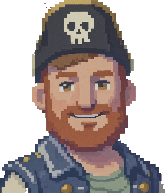
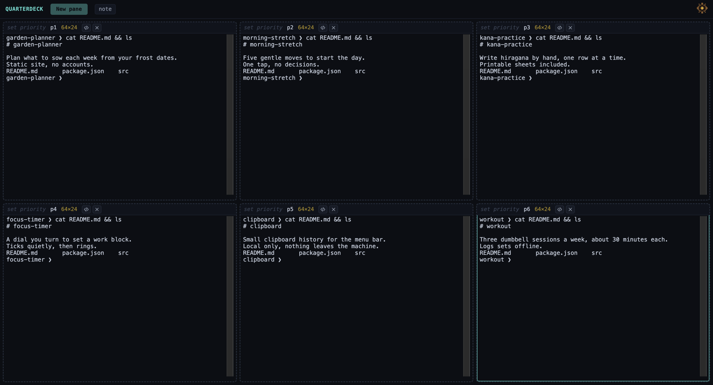
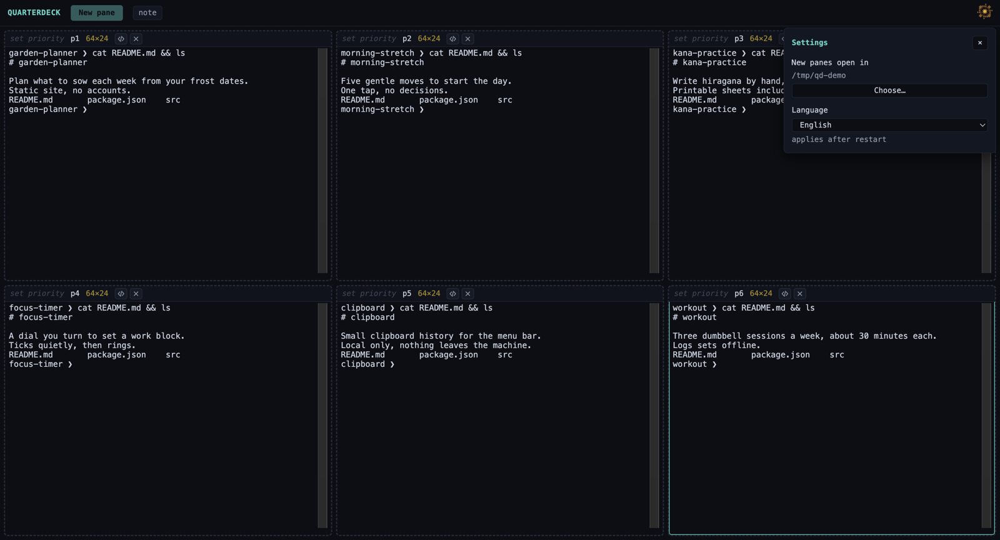

# Quarterdeck

<p align="center"></p>

**Ahoooy, captain!** 🏴‍☠️

On a ship, the quarterdeck is where the captain stands: you see the whole deck from there
and step in only where you're needed. This app is that spot for your Claude Code sessions.

Run up to six sessions side by side in one window. Each pane's border tells you how its
session is doing — thinking, waiting for you, asking permission, done — so you stop
clicking through tabs to find the one that needs you.



## Why

I built it for the days when I'm not writing code myself but running several agents at once.
With one session that's easy. With four, I kept rotating through terminal tabs and editor
windows asking "is this one waiting for me?", and every rotation cost a bit of attention.
Quarterdeck answers that question with a color, so I switch context only when a session
actually needs me.

## Install

```bash
brew install --cask demircraftco/quarterdeck/quarterdeck
```

macOS on Apple Silicon. The app is signed with an Apple Developer ID and notarized by Apple.

To update later:

```bash
brew upgrade --cask quarterdeck
```

## First run

Quarterdeck creates `~/Quarterdeck` and opens new panes there. To use another folder, click
the helm in the top-right corner (or press **⌘,**) and choose one. Changing it affects new
panes only; open panes stay where they are.



## What it does

- **Live panes.** Up to six real terminals in one window, each running your own shell.
  Start `claude` in any of them.
- **State as color.** Each pane's border shows the session inside: running, waiting for
  input, needs permission, idle, done — or unknown, which stays unknown rather than being
  guessed.
- **Context weight.** The pane title shows where the session's context goes: the fixed base,
  tool results, and the conversation itself, so you can tell which kind of compaction helps.
- **Priority marks.** **⌘1–4** mark the focused pane as *now*, *plan*, *delegate* or *drop*.
- **Quick note.** **⌘J** opens a note drawer running its own Claude session in
  `~/.quarterdeck/not`; it does not take a pane slot.
- **Drag to rearrange.** Grab a pane by its title bar. The terminal body belongs to the
  terminal.
- **Open in VS Code.** The `</>` button in a pane's title bar opens that pane's folder in VS Code:
  the folder of the Claude session last seen in it, otherwise the folder the shell started in.
- **Panes survive their shell.** When a shell exits the pane stays and can be restarted in place.
- **English or Turkish.** In settings or View → Language.

### How it knows the state

From `~/.claude/sessions/<pid>.json`, matched to the pane's shell by walking the process tree.
Nothing parses the terminal output, so a redesign of Claude Code's interface cannot break it.

## Requirements

- macOS on Apple Silicon
- [Claude Code](https://docs.anthropic.com/en/docs/claude-code) installed and on your `PATH`

## What's next

Being built now, not in this release yet:

- **Captain's Deck** — a daily board inside Quarterdeck: your tasks, their state, and a
  button that resumes the right session in a pane.
- **Work surfaces** — small reports on your working records (open worktrees, notes, what is
  ready to archive), each with its own region on the board.

Ideas and rough edges are welcome — that's how the next version gets shaped.

<!-- Captain's Deck screenshot goes here:  -->

## License

Free to use. Quarterdeck is closed source; all rights reserved — see [`LICENSE`](LICENSE).
